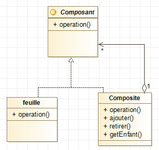

# Le design pattern

Il existe donc le design pattern composite qui permet de gérer un ensemble d'objets en tant qu'un seul et même objet, autrement dis un objet composé de plusieurs autres.
Il permet d'additionner les propriétés des différents objets (par exemple un prix) pour en composer un seul et même.

# Quizz

Et maintenant, un quizz pour voir si vous avez suivi !

?[What is the answer to Life, the Universe and Everything?]
-[ ] There is no answer to that!
-[ ] Sleep and eat
-[x] Easy, this is 42
-[ ] Peace & Love

?[What is the answer to Life, the Universe and Everything?]
-[ ] There is no answer to that!
-[ ] Sleep and eat
-[x] Easy, this is 42
-[ ] Peace & Love

?[What is the answer to Life, the Universe and Everything?]
-[ ] There is no answer to that!
-[ ] Sleep and eat
-[x] Easy, this is 42
-[ ] Peace & Love

?[What is the answer to Life, the Universe and Everything?]
-[ ] There is no answer to that!
-[ ] Sleep and eat
-[x] Easy, this is 42
-[ ] Peace & Love

?[What is the answer to Life, the Universe and Everything?]
-[ ] There is no answer to that!
-[ ] Sleep and eat
-[x] Easy, this is 42
-[ ] Peace & Love
