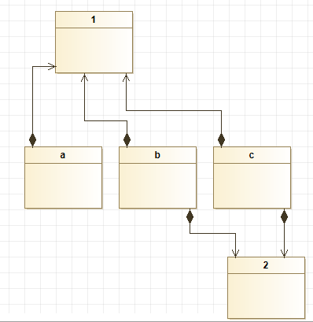

# Introduction

Bienvenue sur ce tuto du design pattern Composite !

# Problematique

Il est facile de gérer des objets en Java.

Il est toutefois beaucoup plus dur de gérer un ensemble d'objets en tant qu'un seul.

Comme nous pouvons voir sur cette image, en java lorsque l'on veut créer des objets composés, il faut créer une classe par objet. De plus, pour supprimer un élément d'un objet, il faut directement aller dans le code de sa classe.

Comment pouvons nous faciliter la gestion de cet ensemble d'objets ?
